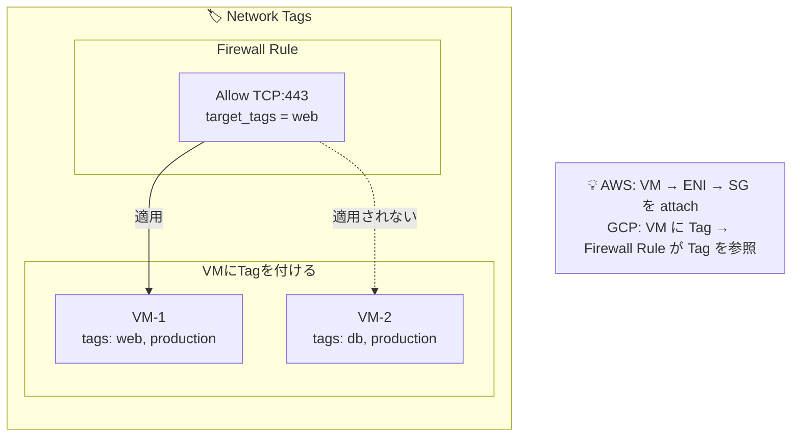

# AWS経験者向け マルチクラウド学習ロードマップ

## 設計思想の違い

| 観点      | AWS     | Azure     | Google Cloud         |
|---------|---------|-----------------------------|----------------------|
| 生まれた背景  | ECサイト運営で培った大量・安定インフラの再利用 | 企業向けIT（Microsoft製品）をクラウドに統合 | 検索・広告で培った超大規模データ処理基盤 |
| 得意分野    | 選択肢が多く、細かく組み合わせられる       | Microsoft製品と自然につながる         | データ分析・機械学習・高速ネットワーク  |
| 基本的な考え方 | 部品を選んで自分で組み立てる           | 既存製品をまとめて使う                 | できるだけシンプルにして自動でスケール  |
| 料金の考え方  | 使った分だけ細かく課金              | 企業契約を前提に比較的まとまった単位で課金       | 秒単位で無駄なく課金（最小1分）     |

---

## Azure & GCP 重要概念まとめ（AWS経験者向け）

### Part 1: Azure 重要概念

**1. リソース階層**  

```text
┌─────────────────────────────────────────────────────────────┐
│  Entra ID Tenant（旧 Azure AD Tenant）                       │
│  └─ 組織の ID 基盤。1テナント = 1組織                           │
└─────────────────────────────────────────────────────────────┘
                            │
                            ▼
┌─────────────────────────────────────────────────────────────┐
│  Management Group（管理グループ）                             │
│  └─ Subscription をまとめる論理グループ                        │
│  └─ ポリシーや RBAC を一括適用可能                             │
│  └─ 最大6階層までネスト可能                                     │
└─────────────────────────────────────────────────────────────┘
                            │
                            ▼
┌─────────────────────────────────────────────────────────────┐
│  Subscription（サブスクリプション）                             │
│  └─ 課金の境界                                               │
│  └─ AWSアカウントに最も近い概念                               │
│  └─ 1テナントに複数Subscription可                           │
└─────────────────────────────────────────────────────────────┘
                            │
                            ▼
┌─────────────────────────────────────────────────────────────┐
│  Resource Group - RG（リソースグループ）                     │
│  └─ リソースをまとめる論理コンテナ                           │
│  └─ ライフサイクル管理の単位                                 │
│  └─ RG削除 → 中のリソース全削除                              │
│  └─ リージョンをまたいでリソースを入れられる                  │
└─────────────────────────────────────────────────────────────┘
                            │
                            ▼
┌─────────────────────────────────────────────────────────────┐
│  Resource（リソース）                                        │
│  └─ VM, Storage Account, VNet など実体                      │
└─────────────────────────────────────────────────────────────┘
```

**AWSとの比較**  

| Azure | AWS | 備考 |
|-------|-----|------|
| Tenant | Organization | IDの親玉 |
| Management Group | OU (Organizational Unit) | ポリシー適用単位 |
| Subscription | Account | 課金境界 |
| Resource Group | **なし** | ←これが最大の違い |
| Resource | Resource | 同じ |

#### 2. ID・認証・認可

**Entra ID（旧 Azure AD / Azure Active Directory）**  

```text
【Entra ID の役割】
┌────────────────────────────────────────┐
│  認証 (Authentication) を担当     　     │
│  「あなたは誰？」　を確認する          　   │
├────────────────────────────────────────┤
│  • User         　　　　　　　　　　      │
│  • Group                 　　　　　　　  │
│  • Service  Principal　　　　　　　　　   │
│  • Managed  Identity  　 　　　　 　　　　│
└────────────────────────────────────────┘

【AWS との対比】
AWS IAM User/Role  ≒  Entra ID User + Service Principal
AWS IAM Policy     ≒  Azure RBAC Role（別システム）
```

**主要な ID タイプ**  

| 名称 | 説明 | AWS相当 |
|------|------|---------|
| **User** | 人間のアカウント | IAM User |
| **Group** | Userをまとめる | IAM Group |
| **Service Principal - SP** | アプリ/サービス用ID | IAM Role (アプリ用) |
| **Managed Identity - MI** | Azureリソース用の自動管理ID | IAM Role (EC2用) |

**【Managed Identity の種類】**  

```text
1. System-assigned（システム割り当て）
   - リソースと1:1で紐づく
   - リソース削除で自動削除
   - AWS: EC2 Instance Profile に近い

2. User-assigned（ユーザー割り当て）
   - 独立したリソースとして作成
   - 複数リソースで共有可能
   - AWS: IAM Role を複数EC2で使い回すイメージ
```

**RBAC（Role-Based Access Control / ロールベースアクセス制御）**  

```text
【RBAC の役割】
┌────────────────────────────────────────┐
│ 認可 (Authorization) を担当      　      │
│ 何ができるかを制御する            　       │
└────────────────────────────────────────┘

【3つの要素】
┌──────────────────┐
│  Security        │  誰が？
│  Principal       │  (User/Group/SP/MI)
└────────┬─────────┘
         │
         ▼  に対して
┌──────────────────┐
│  Role            │  何ができる？
│  Definition      │  (権限の定義)
└────────┬─────────┘
         │
         ▼  を
┌──────────────────┐
│  Scope           │  どの範囲で？
│                  │  (MG/Sub/RG/Resource)
└──────────────────┘

この3つを紐づけるのが Role Assignment（ロール割り当て）

```

**Entra ID と RBAC の関係**  


**組み込みロール（Built-in Roles）**  

| ロール名 | 権限 | AWS相当 |
|----------|------|---------|
| **Owner** | フルアクセス + 権限委譲可 | AdministratorAccess |
| **Contributor** | フルアクセス（権限管理以外） | PowerUserAccess |
| **Reader** | 読み取りのみ | ReadOnlyAccess |
| **User Access Administrator** | 権限管理のみ | IAMFullAccess |

**【AWSとの決定的な違い】**  

```text
AWS:  IAM Policy を User/Role に attach
      └─ Policy は Account 全体に影響

Azure: Role を Scope に assign
       └─ Scope によって影響範囲が変わる
       
# 例：同じ「Contributor」でも
# - Subscription に割り当て → Subscription 全体
# - Resource Group に割り当て → その RG 内だけ
# - 1つの VM に割り当て → その VM だけ
```

#### 3. ネットワーク

**基本構成要素**  

```text
┌─────────────────────────────────────────────────────────┐
│  VNet（Virtual Network / 仮想ネットワーク）              │
│  └─ リージョン内で閉じる（AWSと同じ）                    │
│  └─ CIDR を指定して作成                                 │
├─────────────────────────────────────────────────────────┤
│  ┌─────────────────┐  ┌─────────────────┐              │
│  │  Subnet         │  │  Subnet         │              │
│  │  10.0.1.0/24    │  │  10.0.2.0/24    │              │
│  │                 │  │                 │              │
│  │  ┌───┐ ┌───┐   │  │  ┌───┐         │              │
│  │  │VM │ │VM │   │  │  │VM │         │              │
│  │  │   │ │   │   │  │  │   │         │              │
│  │  │NIC│ │NIC│   │  │  │NIC│         │              │
│  │  └───┘ └───┘   │  │  └───┘         │              │
│  └─────────────────┘  └─────────────────┘              │
└─────────────────────────────────────────────────────────┘
```

**NIC（Network Interface Card）**  

```text
【NIC とは】
VM にアタッチするネットワークの接続点

┌─────────────────────────────────────┐
│  VM (Virtual Machine)               │
│                                     │
│    ┌─────────────────────────┐     │
│    │  NIC                     │     │
│    │  ├─ Private IP           │     │
│    │  ├─ Public IP (optional) │     │
│    │  └─ NSG (optional)       │←─── NICレベルでNSG付与可能
│    └─────────────────────────┘     │
└─────────────────────────────────────┘

【AWS との違い】
AWS:  ENI は EC2 から独立したリソース（似てる）
      Security Group は ENI に付ける

Azure: NIC も独立したリソース
       NSG は NIC にも Subnet にも付けられる ←ここが違う
```

**NSG（Network Security Group / ネットワークセキュリティグループ）**  

```text
【NSG = AWS Security Group + Network ACL のハイブリッド】

┌────────────────────────────────────────────────────────┐
│  NSG の特徴                                            │
├────────────────────────────────────────────────────────┤
│  • Stateful（戻りトラフィック自動許可）                 │
│  • 優先度（100-4096）で評価順を制御                     │
│  • Inbound / Outbound 両方設定                        │
│  • Subnet または NIC に関連付け                        │
│  • 両方に付けた場合、両方評価される                     │
└────────────────────────────────────────────────────────┘

【評価順序】
Inbound:   Internet → Subnet NSG → NIC NSG → VM
Outbound:  VM → NIC NSG → Subnet NSG → Internet

【デフォルトルール（削除不可）】
優先度65000: VNet内通信許可
優先度65001: Azure LB からの通信許可
優先度65500: 全拒否
```

**AWS Security Group との比較**  

| 項目 | AWS SG | Azure NSG |
|------|--------|-----------|
| Stateful | ○ | ○ |
| 優先度 | なし（全ルール評価） | あり（順番に評価） |
| アタッチ先 | ENI のみ | NIC or Subnet |
| デフォルト | 全拒否 | 全拒否 |
| ルール上限 | 60（拡張可） | 1000 |

#### ASG（Application Security Group）

```text
【ASG = VMをグループ化してNSGルールで参照】

# AWS では SG を他の SG から参照できる
# Azure では ASG を作って NSG ルールで参照

┌─────────────────────────────────────────────┐
│  ASG: "WebServers"                          │
│  ├─ VM1                                     │
│  └─ VM2                                     │
└─────────────────────────────────────────────┘

NSG ルール例：
  Allow TCP 443 from ASG:"FrontEnd" to ASG:"WebServers"
```

#### その他重要なネットワーク用語

| 名称 | Full Name | 説明 | AWS相当 |
|------|-----------|------|---------|
| **VNet Peering** | Virtual Network Peering | VNet間接続 | VPC Peering |
| **VNet Gateway** | Virtual Network Gateway | VPN/ExpressRoute用 | VGW |
| **Azure Firewall** | - | マネージドFW | Network Firewall |
| **UDR** | User Defined Route | カスタムルート | Route Table |
| **NAT Gateway** | - | アウトバウンドNAT | NAT Gateway |
| **Private Endpoint** | - | PaaS へのプライベート接続 | VPC Endpoint |
| **Private Link** | - | Private Endpointの仕組み | PrivateLink |

---

### 4. コンピューティング

| 名称 | Full Name | 説明 | AWS相当 |
|------|-----------|------|---------|
| **VM** | Virtual Machine | 仮想マシン | EC2 |
| **VMSS** | Virtual Machine Scale Set | オートスケール | Auto Scaling Group |
| **Availability Set** | - | 障害ドメイン分散 | Placement Group |
| **Availability Zone** | - | 可用性ゾーン | AZ |
| **Azure Functions** | - | サーバーレス関数 | Lambda |
| **App Service** | - | PaaS Web ホスティング | Elastic Beanstalk |
| **ACI** | Azure Container Instances | コンテナ実行 | Fargate (単発) |
| **AKS** | Azure Kubernetes Service | K8s マネージド | EKS |
| **ACR** | Azure Container Registry | コンテナレジストリ | ECR |

---

### 5. ストレージ

#### Storage Account の構造


#### 冗長性オプション

| オプション | Full Name | 説明 |
|------------|-----------|------|
| **LRS** | Locally Redundant Storage | 単一DC内3コピー |
| **ZRS** | Zone-Redundant Storage | 3AZに分散 |
| **GRS** | Geo-Redundant Storage | 2リージョンに分散 |
| **GZRS** | Geo-Zone-Redundant Storage | ZRS + GRS |
| **RA-GRS** | Read-Access GRS | GRS + セカンダリ読み取り可 |

#### Blob Storage の階層

| 階層 | 説明 | AWS相当 |
|------|------|---------|
| **Hot** | 頻繁アクセス | S3 Standard |
| **Cool** | 30日以上保存 | S3 Standard-IA |
| **Cold** | 90日以上保存 | S3 Glacier IR |
| **Archive** | 180日以上保存 | S3 Glacier |

### 6. その他重要サービス

| 名称 | Full Name | 説明 | AWS相当 |
|------|-----------|------|---------|
| **Azure SQL** | Azure SQL Database | マネージドSQL | RDS SQL Server |
| **Cosmos DB** | - | グローバル分散NoSQL | DynamoDB Global |
| **Key Vault** | - | シークレット管理 | Secrets Manager + KMS |
| **Monitor** | Azure Monitor | 監視基盤 | CloudWatch |
| **Log Analytics** | - | ログ分析 | CloudWatch Logs Insights |
| **Application Insights** | - | APM | X-Ray |
| **Policy** | Azure Policy | ガバナンス | SCP + Config Rules |
| **Blueprints** | Azure Blueprints | 環境テンプレート | Control Tower |
| **ARM** | Azure Resource Manager | デプロイ基盤 | CloudFormation |
| **Bicep** | - | ARM の DSL | - |

## Part 2: Google Cloud 重要概念

### 1. リソース階層

```text
┌─────────────────────────────────────────────────────────────┐
│  Organization（組織）                                        │
│  └─ Google Workspace または Cloud Identity に紐づく          │
│  └─ なくても使える（個人利用時）                             │
└─────────────────────────────────────────────────────────────┘
                            │
                            ▼
┌─────────────────────────────────────────────────────────────┐
│  Folder（フォルダ）                                          │
│  └─ Project をまとめる論理グループ                           │
│  └─ 複数階層ネスト可能                                       │
│  └─ 部門や環境ごとに分ける                                   │
└─────────────────────────────────────────────────────────────┘
                            │
                            ▼
┌─────────────────────────────────────────────────────────────┐
│  Project（プロジェクト）                                     │
│  └─ リソース・課金・権限の基本単位                           │
│  └─ AWSアカウントに近いが、より軽量                          │
│  └─ 全リソースは必ず1つの Project に属する                   │
└─────────────────────────────────────────────────────────────┘
                            │
                            ▼
┌─────────────────────────────────────────────────────────────┐
│  Resource（リソース）                                        │
│  └─ VM, GCS Bucket, VPC など                                │
└─────────────────────────────────────────────────────────────┘
```

### Project の識別子（重要！）

```mermaid
【3つの識別子】

1. Project Name
   - 人間が読む用
   - 変更可能
   - 一意でなくてよい

2. Project ID
   - システムが使う
   - グローバルで一意
   - 変更不可 ← 重要！
   - terraform や gcloud で使う

3. Project Number
   - Google が自動付与
   - 数字のみ
   - 一部APIで使用
```

### AWS/Azure との比較

| GCP | AWS | Azure |
|-----|-----|-------|
| Organization | Organization | Tenant |
| Folder | OU | Management Group |
| Project | Account | Subscription |
| - | - | Resource Group（GCPにはない） |

---

## 2. IAM（Identity and Access Management）

### 基本構造

```mermaid
【GCP IAM の考え方】

    誰が        何を         どこで
      │          │            │
      ▼          ▼            ▼
┌─────────┐ ┌─────────┐ ┌─────────────┐
│ Member  │ │  Role   │ │  Resource   │
│         │ │         │ │  (階層)     │
└────┬────┘ └────┬────┘ └──────┬──────┘
     │          │             │
     └──────────┴─────────────┘
                │
                ▼
         IAM Policy Binding
         
# AWS は Policy を User/Role に attach
# GCP は Member に Role を bind（リソース階層で）
```

### Member の種類

| Member タイプ | 形式 | 説明 |
|--------------|------|------|
| **Google Account** | user:email@gmail.com | 個人アカウント |
| **Service Account** | serviceAccount:name@project.iam.gserviceaccount.com | サービス用 |
| **Google Group** | group:name@googlegroups.com | グループ |
| **Google Workspace Domain** | domain:example.com | ドメイン全体 |
| **allAuthenticatedUsers** | - | 認証済み全ユーザー |
| **allUsers** | - | インターネット全体（危険！） |

### Service Account（SA）

```text
【Service Account = GCP版のIAM Role】

┌────────────────────────────────────────────────────┐
│  Service Account の特徴                            │
├────────────────────────────────────────────────────┤
│  • アプリやVMが使うID                              │
│  • email形式で識別                                 │
│  • キーを発行可能（非推奨）                        │
│  • VM に直接アタッチ可能                           │
│  • Workload Identity で K8s と連携                 │
└────────────────────────────────────────────────────┘

【AWS との対比】
AWS EC2:  Instance Profile → IAM Role → Policy
GCP GCE:  VM → Service Account → Role binding

【キーの種類】
1. Google管理キー（推奨）
   - 自動ローテーション
   - ユーザーはキーを見れない

2. ユーザー管理キー（非推奨）
   - JSONキーファイル
   - 漏洩リスクあり
   - ローカル開発時のみ使う
```

### Role の種類

```text
【3種類のRole】

1. Basic Roles（基本ロール）旧称: Primitive Roles
   ├─ Owner    : フル権限 + IAM管理
   ├─ Editor   : 読み書き（IAM管理以外）
   └─ Viewer   : 読み取りのみ
   
   ※ 本番では使わない（権限が広すぎる）

2. Predefined Roles（事前定義ロール）
   ├─ roles/compute.admin
   ├─ roles/storage.objectViewer
   └─ roles/cloudsql.client
   
   ※ 基本これを使う

3. Custom Roles（カスタムロール）
   └─ 必要な権限だけを組み合わせ
   
   ※ 最小権限の原則を徹底する場合
```

### 重要な Predefined Roles

| Role | 説明 | AWS相当 |
|------|------|---------|
| roles/owner | 全権限 | AdministratorAccess |
| roles/editor | 編集権限 | PowerUserAccess |
| roles/viewer | 読取権限 | ReadOnlyAccess |
| roles/compute.admin | Compute全権限 | EC2FullAccess |
| roles/compute.instanceAdmin | VM管理 | - |
| roles/storage.admin | GCS全権限 | S3FullAccess |
| roles/storage.objectViewer | オブジェクト読取 | S3ReadOnlyAccess |
| roles/iam.serviceAccountUser | SA使用権限 | iam:PassRole相当 |

### IAM Conditions（条件付きアクセス）

```text
【IAM Conditions = 条件付きロール付与】

例：特定IPからのみ許可
{
  "role": "roles/storage.objectViewer",
  "members": ["user:alice@example.com"],
  "condition": {
    "expression": "request.auth.claims.email.endsWith('@example.com')",
    "title": "Only internal users"
  }
}

# AWS IAM Policy の Condition に相当
```

## AWS IAM Policy の Condition に相当  

## 3. ネットワーク（最大の違い！）

### VPC（Virtual Private Cloud）

```text
【GCP VPC = グローバルリソース！】

これがAWSとの最大の違い

AWS VPC:
┌─────────────────────────────────────────┐
│  VPC (us-east-1)                        │
│  ├─ Subnet-A (us-east-1a)               │
│  └─ Subnet-B (us-east-1b)               │
└─────────────────────────────────────────┘
┌─────────────────────────────────────────┐
│  VPC (ap-northeast-1)  ← 別VPC必要      │
│  ├─ Subnet-A (ap-northeast-1a)          │
│  └─ Subnet-B (ap-northeast-1c)          │
└─────────────────────────────────────────┘

GCP VPC:
┌─────────────────────────────────────────────────────┐
│  VPC (グローバル)                                    │
│  ├─ Subnet (us-central1)     10.0.1.0/24           │
│  ├─ Subnet (asia-northeast1) 10.0.2.0/24           │
│  └─ Subnet (europe-west1)    10.0.3.0/24           │
│                                                     │
│  → 同一VPC内で全リージョンが通信可能！               │
│  → Peering 不要                                     │
└─────────────────────────────────────────────────────┘
```

### VPC のモード

```text
【Auto Mode vs Custom Mode】

1. Auto Mode VPC
   - 各リージョンに自動でSubnet作成
   - CIDR は Google が決定
   - 学習・テスト用

2. Custom Mode VPC（推奨）
   - Subnet を手動作成
   - CIDR を自分で設計
   - 本番環境はこれ

# Terraform では auto_create_subnetworks = false
```

### Firewall Rules

```text
【GCP Firewall = VPCレベルで適用】

AWS:  Security Group → ENI に付与
GCP:  Firewall Rule → VPC全体に適用 → Target で絞る

┌────────────────────────────────────────────────────┐
│  Firewall Rule の構成要素                          │
├────────────────────────────────────────────────────┤
│  Direction    : INGRESS / EGRESS                  │
│  Priority     : 0-65535（小さいほど優先）          │
│  Action       : allow / deny                      │
│  Target       : 適用先（後述）                    │
│  Source/Dest  : IP範囲 or Tag or SA               │
│  Protocol     : tcp, udp, icmp など               │
│  Ports        : ポート番号                        │
└────────────────────────────────────────────────────┘

【Target の指定方法】
1. All instances in VPC      : VPC全体
2. Specified target tags     : Network Tag で指定
3. Specified service accounts: SA で指定
```

### Network Tags



### 重要なネットワーク用語

| 名称 | Full Name | 説明 | AWS相当 |
|------|-----------|------|---------|
| **VPC** | Virtual Private Cloud | グローバルネットワーク | VPC |
| **Subnet** | Subnetwork | リージョナル | Subnet |
| **Firewall Rules** | - | VPCレベルFW | SG + NACL |
| **Cloud Router** | - | BGPルーター | - |
| **Cloud NAT** | - | マネージドNAT | NAT Gateway |
| **VPC Peering** | - | VPC間接続 | VPC Peering |
| **Shared VPC** | - | 複数Projectで共有 | RAM + VPC共有 |
| **Cloud VPN** | - | VPN接続 | Site-to-Site VPN |
| **Cloud Interconnect** | - | 専用線接続 | Direct Connect |
| **PGA** | Private Google Access | Google APIへのプライベート接続 | VPC Endpoint |
| **PSC** | Private Service Connect | サービスへのプライベート接続 | PrivateLink |

### Shared VPC

```text
【Shared VPC = 複数 Project で VPC を共有】

┌─────────────────────────────────────────────────────┐
│  Host Project（ホストプロジェクト）                  │
│  └─ VPC を所有                                      │
│  └─ Subnet を管理                                   │
└─────────────────────────────────────────────────────┘
         │
         │ 共有
         ▼
┌─────────────────────────────────────────────────────┐
│  Service Project（サービスプロジェクト）             │
│  └─ Host Project の Subnet を使用                   │
│  └─ VM などを作成                                   │
└─────────────────────────────────────────────────────┘

# 大規模環境でネットワークを一元管理する時に使う
# AWS では Organizations + RAM で似たことができる
```

---

### 4. コンピューティング  

#### GCE（Google Compute Engine）

| 名称 | Full Name | 説明 | AWS相当 |
|------|-----------|------|---------|
| **GCE** | Google Compute Engine | 仮想マシン | EC2 |
| **Instance Template** | - | VM設定テンプレート | Launch Template |
| **MIG** | Managed Instance Group | オートスケール | Auto Scaling Group |
| **Preemptible VM** | - | 格安（24h以内停止） | Spot Instance |
| **Spot VM** | - | 新しい格安VM | Spot Instance |
| **Sole-tenant Node** | - | 専有ホスト | Dedicated Host |

### マシンタイプ

```text
【マシンタイプの命名規則】

e2-standard-4
│   │       │
│   │       └─ vCPU数
│   └─ シリーズ（standard/highmem/highcpu）
└─ ファミリー

【主なファミリー】
E2  : 汎用（コスパ良）
N2  : 汎用（高性能）
N2D : AMD EPYC
C2  : コンピュート最適化
M2  : メモリ最適化
A2  : GPU（A100）
```

### その他のコンピュート

| 名称 | Full Name | 説明 | AWS相当 |
|------|-----------|------|---------|
| **GKE** | Google Kubernetes Engine | K8s マネージド | EKS |
| **Cloud Run** | - | サーバーレスコンテナ | Fargate + App Runner |
| **Cloud Functions** | - | FaaS | Lambda |
| **GAE** | Google App Engine | PaaS | Elastic Beanstalk |
| **Anthos** | - | ハイブリッド/マルチクラウド | EKS Anywhere |

---

## 5. ストレージ

### GCS（Google Cloud Storage）

```text
【GCS = S3 相当】

構造：
gs://bucket-name/object-key
      │
      └─ グローバルで一意

【ストレージクラス】
Standard       : 頻繁アクセス    → S3 Standard
Nearline       : 月1回アクセス   → S3 Standard-IA
Coldline       : 年1回アクセス   → S3 Glacier IR
Archive        : 年1回未満       → S3 Glacier Deep Archive

【ロケーションタイプ】
Region         : 単一リージョン
Dual-region    : 2リージョン
Multi-region   : 大陸レベル（US, EU, ASIA）
```

### その他のストレージ

| 名称 | Full Name | 説明 | AWS相当 |
|------|-----------|------|---------|
| **GCS** | Google Cloud Storage | オブジェクトストレージ | S3 |
| **PD** | Persistent Disk | ブロックストレージ | EBS |
| **Filestore** | - | マネージドNFS | EFS |
| **Cloud SQL** | - | マネージドRDB | RDS |
| **Cloud Spanner** | - | グローバル分散RDB | Aurora Global |
| **Firestore** | - | ドキュメントDB | DynamoDB |
| **Bigtable** | - | 大規模NoSQL | DynamoDB（超大規模） |
| **BQ** | BigQuery | データウェアハウス | Redshift + Athena |
| **Memorystore** | - | マネージドRedis/Memcached | ElastiCache |

---

## 6. その他重要サービス

| 名称 | Full Name | 説明 | AWS相当 |
|------|-----------|------|---------|
| **Cloud Monitoring** | - | メトリクス監視 | CloudWatch |
| **Cloud Logging** | - | ログ管理 | CloudWatch Logs |
| **Cloud Trace** | - | 分散トレーシング | X-Ray |
| **Cloud Profiler** | - | プロファイリング | CodeGuru Profiler |
| **Error Reporting** | - | エラー追跡 | - |
| **Cloud KMS** | Key Management Service | 鍵管理 | KMS |
| **Secret Manager** | - | シークレット管理 | Secrets Manager |
| **Cloud Armor** | - | WAF/DDoS防御 | WAF + Shield |
| **Cloud CDN** | - | CDN | CloudFront |
| **Cloud DNS** | - | DNS | Route 53 |
| **Cloud Load Balancing** | - | LB（グローバル） | ALB/NLB + Global Accelerator |
| **Pub/Sub** | - | メッセージング | SNS + SQS |
| **Cloud Tasks** | - | タスクキュー | SQS |
| **Cloud Scheduler** | - | cron | EventBridge Scheduler |
| **DM** | Deployment Manager | IaC | CloudFormation |
| **Cloud Build** | - | CI/CD | CodeBuild |
| **Artifact Registry** | - | パッケージ管理 | ECR + CodeArtifact |
| **Cloud Composer** | - | ワークフロー（Airflow） | MWAA |

---

# 学習優先順位

## Azure（AZ-900向け）


## GCP（ACE向け）


2. 

## AWS経験視点の混乱しやすいポイント

### Azure

```text
【リソース階層が全く違う】

AWS:   Account → Region → VPC → Subnet → Resource
Azure: Tenant → Subscription → Resource Group → Resource
                                    ↑
                          これがAWSにない概念！
                          
Resource Group = リソースをまとめる論理的な箱
- リージョンをまたげる
- 課金・権限管理の単位にもなる
- 削除すると中身も全部消える
```

```text
【ネットワークの違い】

AWS VPC:
- リージョン内で閉じる
- AZ跨ぎはSubnetで分ける

Azure VNet:
- リージョン内で閉じる（ここは同じ）
- でもVNet Peeringがグローバル対応
- NSG（Subscription）はSubnetにもNIC（Network Interface ）にも付けられる
```

```text
【IAMの違い】

AWS IAM: 
- User/Role/Policy が独立
- 信頼関係でAssumeRole

Azure RBAC + Entra ID（旧Azure AD）:
- Entra IDでID管理（認証）
- RBACで権限管理（認可）
- スコープ（Management Group/Subscription/RG/Resource）に割り当て

RBAC：Role-Based Access Control
Azureにおける 権限制御の中核 、「① 誰に（Subject）
② 何をさせるか（Role）
③ どこまで（Scope）」をロールで決める仕組み

```

### Google　Cloud

```text
【プロジェクトという概念】

AWS:   Account = 課金・権限の境界
GCP:   Project = 課金・権限・リソースの境界
              ↓
       Organizationの下に複数Project
       AWSのAccountに近いが、より軽量に作れる
```

```text
【VPCがグローバル！】

AWS VPC: リージョン内
GCP VPC: グローバル（全リージョンにまたがる）
         └→ Subnetがリージョンスコープ
         
# これが最大の違い。設計思想が根本的に異なる。
```

```text
【IAMの違い】

AWS:  User/Role にPolicy をattach
GCP:  Member に Role を bind（リソース階層のどこかで）

# GCPのRoleはAWSのPolicyに近い
# GCPにはUserという概念がない（Google Accountを使う）
```

## よく使うもサービス名のマッピング

## 学習のロードマップ
